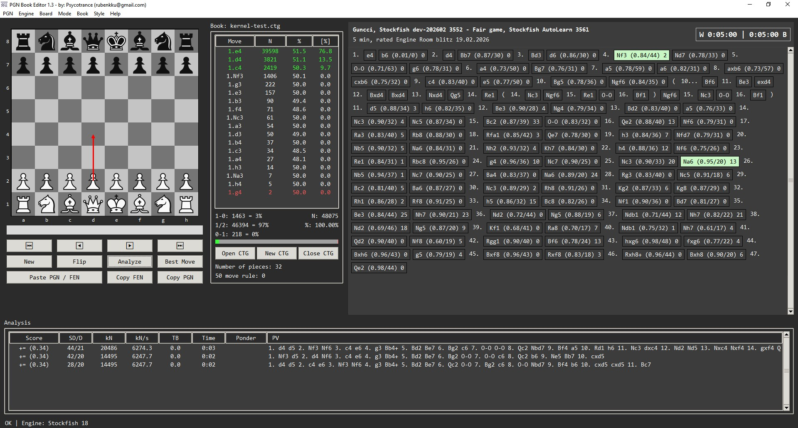

# PGN Book Editor

**PGN Book Editor** is a desktop application written in **Python (Tkinter)** designed for advanced chess work:  
**editing PGN game trees**, **analyzing positions with UCI engines**, and especially **creating and maintaining opening books**.

The program supports **two different book systems**:

- **Polyglot BIN books (`.bin`)** – fast, local opening books  
- **HTTP API books** – remote or local server-based books accessed via REST-like endpoints

This makes PGN Book Editor a powerful tool for players, analysts, and developers who want full control over their opening preparation and PGN structures.

Repository:  
👉 https://github.com/rubenkku/PGN-Book-Editor

---

## Who is this for?

- Chess players studying **openings with deep branching variations**
- Users who want to **edit PGN files properly** (not just linear notation)
- Players maintaining **Polyglot opening books**
- Developers or advanced users running their **own opening book server**
- Anyone who wants to combine **PGN editing + engine analysis + book editing** in one GUI

---

## Key Features

### 1) Full PGN Game Tree Editor
- True **tree-based PGN editing** (mainlines + unlimited variations)
- Clickable move “chips” for fast navigation
- Promote, delete, truncate, or reorder variations
- Node comments and annotations
- Correct PGN export including:
  - headers
  - comments
  - nested variations

---

### 2) Clipboard-friendly Workflow
- Paste **PGN** directly from clipboard
- Paste **FEN** to jump to an exact position
- Copy FEN / Copy PGN at any time
- Quickly build or modify a repertoire from external sources

---

### 3) Polyglot BIN Book Editor
Native support for **Polyglot `.bin` opening books**:

- Read all book moves available in the current position
- Sort moves by **weight**
- Add, edit, or delete moves
- Edit both `weight` and `learn` values
- Bulk operations:
  - **Add Line** – insert the entire current line into the book
  - **Remove Line** – delete a whole branch from the book

Optimized for large books:
- Binary search over sorted Polyglot entries
- In-place updates when possible
- Minimal full rewrites of `.bin` files

---

### 4) HTTP API Book Mode
PGN Book Editor can act as a **GUI frontend** for a remote or local opening book server.

Supported API calls (GET-based) allow querying, storing and editing book moves directly from the GUI.

This enables:
- Centralized opening books
- Engine-generated books stored in databases
- Multi-machine or team workflows

---

### 5) Integrated UCI Engine Analysis
- Install and manage **UCI engines** (e.g. Stockfish)
- Edit engine options (spin, combo, check, string)
- MultiPV analysis
- Time and depth control
- Engine output panel with logging
- Automatic detection of `bestmove` and `ponder`
- Store engine evaluations as PGN comments

Engine and GUI settings are persisted between sessions.

---

### 6) Visual Move Highlighting on the Board
The chessboard provides **clear visual feedback using arrows**, making analysis and navigation intuitive:

- **Last played move** is shown with an arrow
- **Engine best move** (`bestmove`) is marked with a dedicated arrow
- **Ponder move** is displayed simultaneously when available
- **Best book move** (from BIN or API book) is highlighted
- **Live analysis best move** is continuously updated and marked

This allows the user to instantly distinguish between:
- played moves
- book recommendations
- engine suggestions  
directly on the board, without reading text output.

---

### 7) PGN Explorer (Multi-game files)
- Open large PGN files containing many games
- Browse and select individual games
- Load selected games directly into the editor

---

### 8) ECO Opening Detection
- Displays:
  - ECO code
  - Opening name
  - Variation
- Automatically updated as the position changes

---

### 9) Advanced Stockfish Dev Patching (Unique Feature)
PGN Book Editor includes the ability to **patch the latest Stockfish Dev source code** to add features not available in the official engine:

- **Support for up to 4 Polyglot BIN books simultaneously**
  - Automatic book move selection
  - Ideal for layered opening preparation
- **Minimum Thinking Time option**
  - Forces the engine to think at least a given amount of time
  - Extremely important for **bullet and blitz time controls**
  - Prevents instant low-quality moves in very short time settings

This makes the patched engine especially suitable for:
- online play
- fast time controls
- book-heavy opening strategies

---

### 10) Additional Utilities
- Export board position as an image
- Board setup editor
- Promotion handling
- Configurable board colors and fonts
- Clean, keyboard-friendly workflow

---

## Installation

### Option 1 – Use a Release
Check the **Releases** section of the repository for prebuilt packages (if available for your OS).

---

### Option 2 – Run from Source (Python)

#### Requirements
- Python 3.x
- Main dependencies:
  - `python-chess`
  - `Pillow`
  - `chardet` (optional but recommended)

Install dependencies:
```bash
pip install python-chess pillow chardet
```

*Note: This repository does not contain the complete application source code.*
